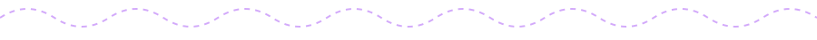
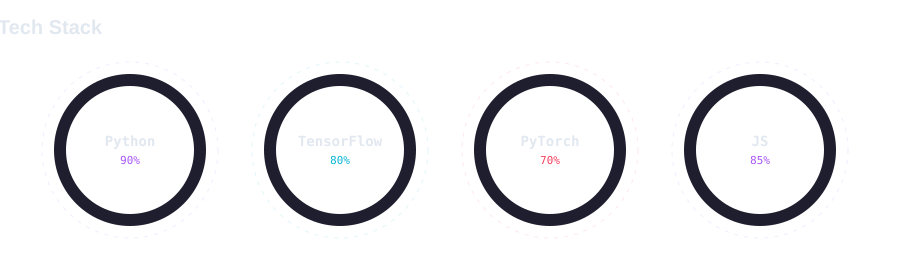
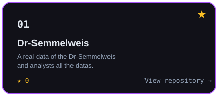
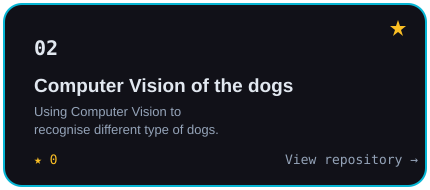

<div align="center">
  
</div>


<div align="center">
  
</div>

```yaml
developer:
  name: "Zahra Sayyahi"
  focus: "Structure & scalable digital systems"
  background:
    - Front-end development
    - E-commerce platforms
    - SEO optimisation workflows
  currently_exploring:
    - Python
    - Machine Learning (ML)
    - Deep Learning (DL)
  mission: "Designing efficient, scalable, and AI-powered solutions 🚀"
```


- 🔭 Currently building projects with **Python** and **ML frameworks**, focused on data-driven modelling and intelligent systems
- 🌱 Deepening my knowledge of **Deep Learning** and practical AI applications
- 👯 Open to collaborating on **AI-powered products** and data-driven tools
- 💬 Ask me about front-end dev, e-commerce, SEO, or ML pipelines
- 📫 Reach me at **avasayyahi368@gmail.com**
- ⚡️ Fun fact: I love turning messy data into clean, intelligent systems

<div align="left">
  
</div>
<br>
<div align="left">
  <a href="https://www.linkedin.com/in/zahra-sayyahi/" target="_blank"></a>
  <a href="mailto:avasayyahi368@gmail.com"></a>
</div>
<br>
<br>
<div align="center">
  
</div>

<div align="center">
  
</div>


<div align="center">
  <a href="https://github.com/zahra-sayyahi/Dr-Semmelweis" target="_blank"></a>
  <a href="https://github.com/zahra-sayyahi/Computer-Vision-of-the-dogs-"></a>
</div>
<!--
<table>
<tr>
<td width="50%">
<a href="https://github.com/zahra-sayyahi/ml-pipeline-toolkit">
  
</a>
</td>
<td width="50%">
<a href="https://github.com/zahra-sayyahi/ecommerce-storefront">
  
</a>
</td>
</tr>
</table>
-->
<br>
<br>
<div align="center">
  
</div>


<div align="center">

  
  <p><sub>lo-fi beats and long debugging sessions</sub></p>
</div>

<!--
<div align="center">
  
  <p><sub>lo-fi beats and long debugging sessions</sub></p>
</div>
<div align="left">
  
</div>
-->


<picture>
  <source media="(prefers-color-scheme: dark)" srcset="https://raw.githubusercontent.com/zahra-sayyahi/zahra-sayyahi/output/github-snake-dark.svg" />
  <source media="(prefers-color-scheme: light)" srcset="https://raw.githubusercontent.com/zahra-sayyahi/zahra-sayyahi/output/github-snake.svg" />
  
</picture>
